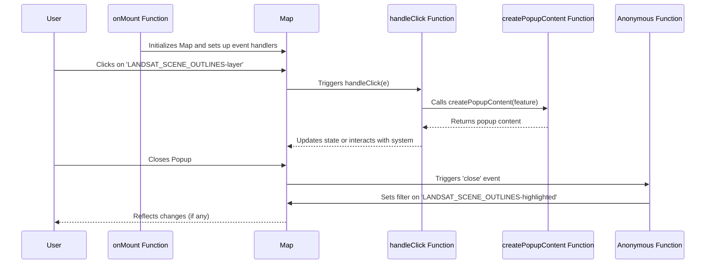
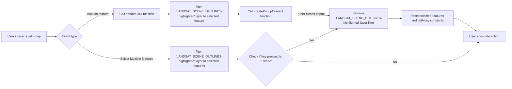
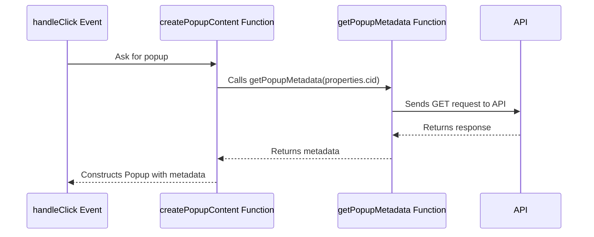
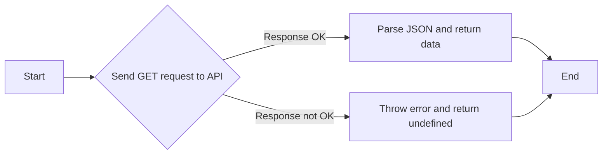
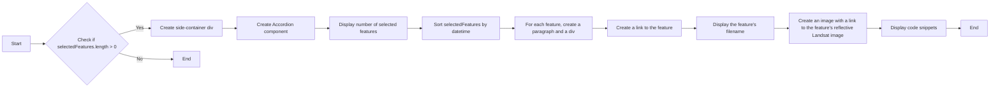

## Sequence of events that that take place when a user interacts with the map

## Flow chart of the different ways a user can interact with features on the map

## Sequence of events to create pop-up when a user clicks on a grid.

## Flowchart of a the API Request to fetch the metadata for a selected CID: getPopupMetadata Function

## Flowchart of the steps to build `
` element for the modal

