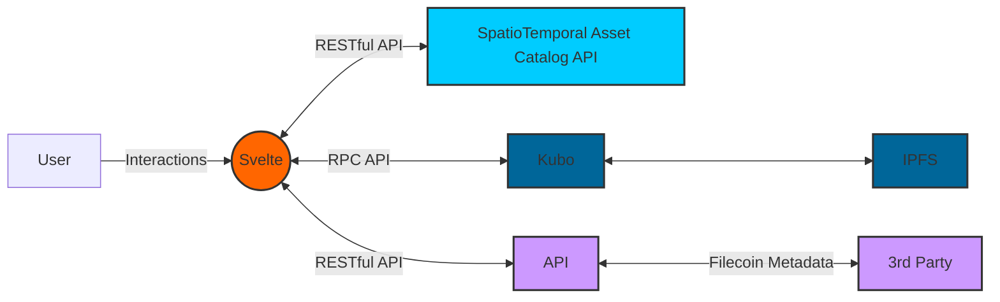
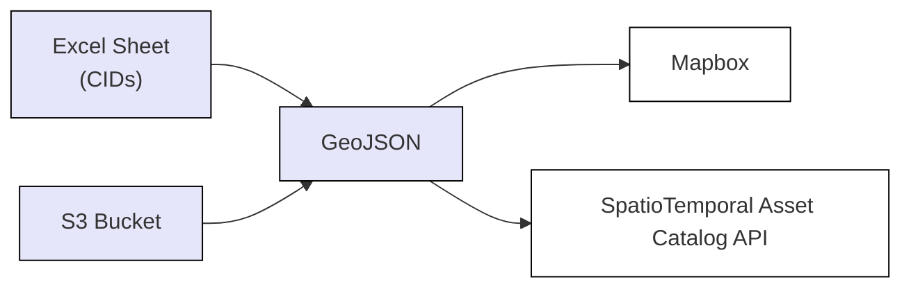
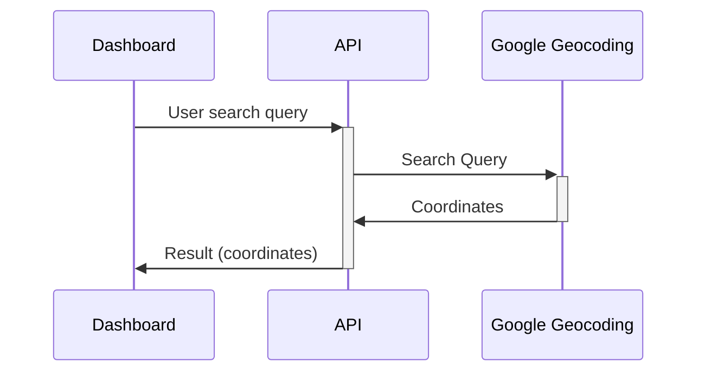
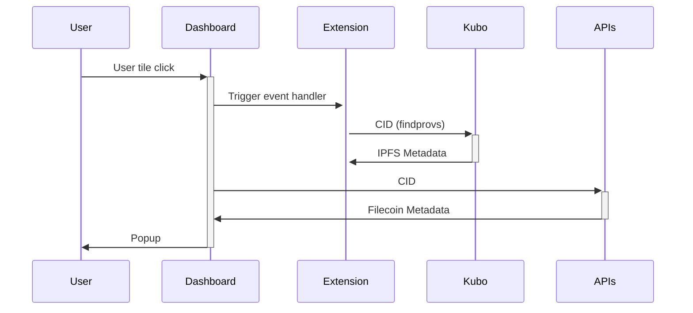
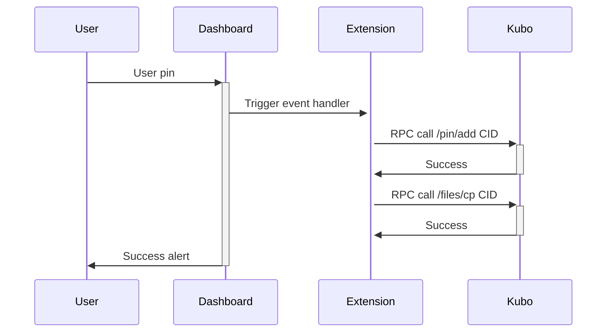
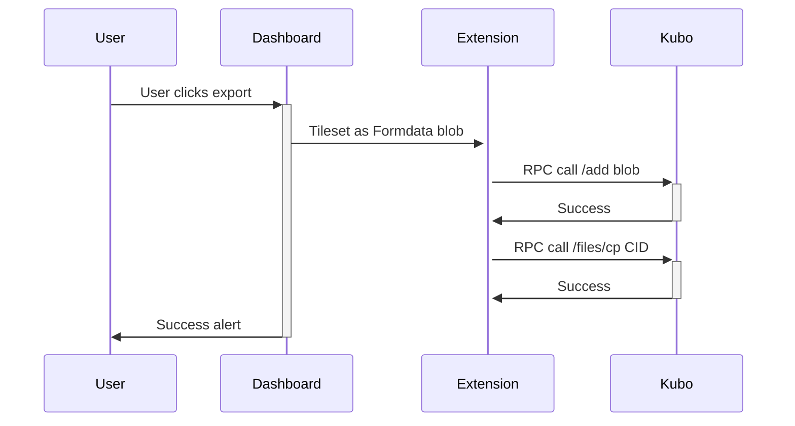
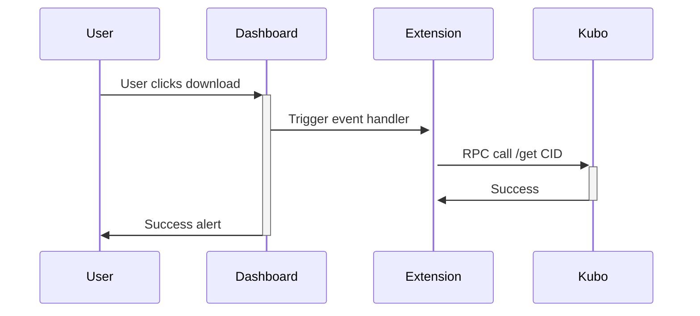

## Project flowchart

```mermaid
graph LR
    User[User]
    Svelte((Svelte))
    IPFS[IPFS]
    STAC[SpatioTemporal Asset Catalog API]
    API[API]
    ThirdParty[3rd Party]
    Kubo[Kubo]

    User -->|Interactions| Svelte

    Svelte <-->|RPC API| Kubo
    Kubo <--> IPFS

    Svelte <-->|RESTful API| STAC

    Svelte <-->|RESTful API| API
    API <-->|Filecoin Metadata| ThirdParty

    style Svelte fill:#f60,stroke:#333,stroke-width:2px
    style IPFS fill:#069,stroke:#333,stroke-width:2px
    style STAC fill:#0cf,stroke:#333,stroke-width:2px
    style API fill:#c9f,stroke:#333,stroke-width:2px
    style ThirdParty fill:#c9f,stroke:#333,stroke-width:2px
    style Kubo fill:#069,stroke:#333,stroke-width:2px
```

## Data ingestion

```mermaid
graph LR
    Excel["Excel Sheet\n(CIDs)"]
    S3["S3 Bucket"]
    GeoJSON["GeoJSON"]
    Mapbox["Mapbox"]
    STAC["SpatioTemporal Asset Catalog API"]

    Excel --> GeoJSON
    S3 --> GeoJSON
    GeoJSON --> Mapbox
    GeoJSON --> STAC

    classDef purple fill:#E6E6FA,stroke:#000,stroke-width:1px;
    class Excel,S3,GeoJSON purple;

    style Mapbox fill:#fff,stroke:#000,stroke-width:1px;
    style STAC fill:#fff,stroke:#000,stroke-width:1px;
```

## Dashboard Geocoding (w/ API)

```mermaid
sequenceDiagram
    Dashboard->>+API: User search query
    API->>+Google Geocoding: Search Query
    Google Geocoding->>-API: Coordinates
    API->>-Dashboard: Result (coordinates)
```

## Dashboard metadata fetching (w/ Extension)

```mermaid
sequenceDiagram
    User->>+Dashboard: User tile click
    Dashboard->>+Extension: Trigger event handler
    Extension->>+Kubo: CID (findprovs)
    Kubo->>-Extension: IPFS Metadata
    Dashboard->>+APIs: CID
    APIs->>-Dashboard: Filecoin Metadata
    Dashboard->>-User: Popup
```

## Pinning data

```mermaid
sequenceDiagram
    User->>+Dashboard: User pin
    Dashboard->>+Extension: Trigger event handler
    Extension->>+Kubo: RPC call /pin/add CID
    Kubo->>-Extension: Success
    Extension->>+Kubo: RPC call /files/cp CID
    Kubo->>-Extension: Success
    Dashboard->>-User: Success alert
```

## Export

```mermaid
sequenceDiagram
    User->>+Dashboard: User clicks export
    Dashboard->>+Extension: Tileset as Formdata blob
    Extension->>+Kubo: RPC call /add blob
    Kubo->>-Extension: Success
    Extension->>+Kubo: RPC call /files/cp CID
    Kubo->>-Extension: Success
    Dashboard->>-User: Success alert
```

## Download click

```mermaid
sequenceDiagram
    User->>+Dashboard: User clicks download
    Dashboard->>+Extension: Trigger event handler
    Extension->>+Kubo: RPC call /get CID
    Kubo->>-Extension: Success
    Dashboard->>-User: Success alert
```
